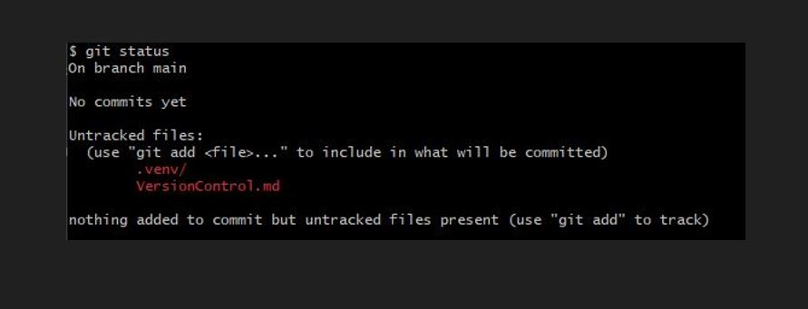
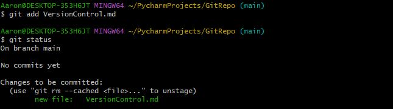
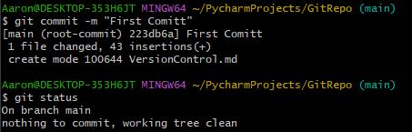
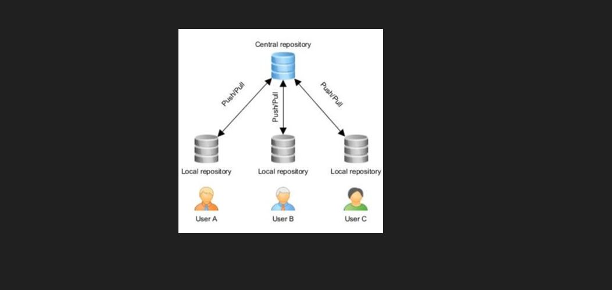
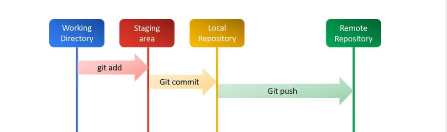
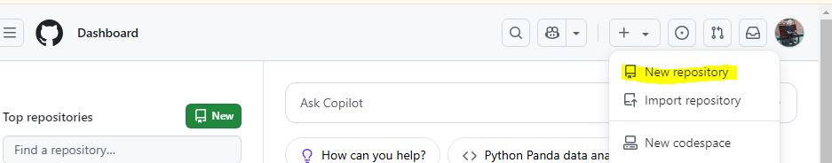

# Version Control, Git, and GitHub

## What is version Control?

Version control is a system that tracks changes to files over time, so you can review, undo, and  collaborate on work. 
 
Think of version control like a tree. The main trunk represents the main version of the project, which everyone uses and builds from. The branches might stay separate for a while, but they can merge back into the main branch. 
## What is Git? 

Git is a version control system. Developers have the flexibility to work offline or from **remote** 
<br/>locations since they maintain a **local** copy of the project's code repository. They can **commit** their changes locally and later **sync** them with the server. Git captures the state of all files at a specific moment, known as a **commit**. Each commit is connected to others, creating a continuous history of the project's development. There are a lot of keywords here like commit, lets find out more. 

 
## The concept of Staging and Committing 

In Git, staging refers to adding specific file changes to the staging area before committing them. 
<br/> When you commit a file, you are saving a snapshot of the staged changes to the repository's history. 

### Step-by-Step Guide to Staging Changes and committing in Git with Commands :

- If you haven't already installed Git you can click the link and download the latest version for your operating system:
   [Git](https://git-scm.com/downloads)
- Once downloaded you can now open the command line interface, **Git Bash**. 
- Assuming you are in the right directory we can create our Git repository :

```commandline
git init
```
- In this example I have already prepared a file, **VersionControl.md**. I can then check the status.
<br/> Regularly checking the status keeps your workflow organised and helps avoid errors before committing changes.
```commandline
git status
```
  
- we can now send our file to the staging area. Check the status again, did you notice the change? 
```commandline
git add VersionControl.md
```
 

- We are now at the final step, ready to fully commit our file. A commit message serves as documentation for the changes you've made. 
```commandline
git commit -m "First Comitt" 
```


We have now officially committed our first file. 

# What is GitHub? 

GitHub is an online platform that hosts remote Git repositories, allowing developers to store, 
<br/>manage, and collaborate on code projects from anywhere. 

## How is GitHub different to Git? 

- Git is a distributed version control system that runs locally on your computer. 
<br/> It tracks changes, manages branches, and allows for collaboration through commits and merges.
- GitHub is a cloud-based remote repository hosting service that extends Git by providing an online platform for storing, sharing, and collaborating on Git repositories.

## What is Distributed VC?

 

Distributed Version Control is a system that allows multiple developers to work on a project 
<br/> simultaneously without relying on a central server. Instead, every developer has a full copy of the 
<br/> entire project history on their own machine. Refer to the diagram above for further clarification. 

### Distributed Version Control (DVC) vs. Not Using DVC using:
| Feature                 | With DVC (Git)                                 | Without DVC                               |
|-------------------------|------------------------------------------------|-------------------------------------------|
| **History Tracking**    | Yes, full history                              | No history, only latest version           |
| **Collaboration**       | Easy, multiple users can work simultaneously   | Difficult, manual file sharing            |
| **Offline Work**        | Yes, full local repository                     | No, depends on manual backups             |
| **Branching & Merging** | Supported, seamless switching between versions | Not possible, manual file copies required |
| **Data Safety**         | Secure, every user has a copy                  | Risky, single copy can be lost            |

## How to sync a remote repository with a local repository 

So we know how to stage and commit with Git but what if we want to take everything to remote repository like GitHub.
 

### Step-by-Step Guide to sync your local repo with a remote repo :

- First you need to create or have an existing GitHub account, for those who don't have an account use the following link to create one : [GitHub](https://github.com/) 
- Next you want to create a new repo by clicking the + sign in the top right corner of your screen.

- Simply give your repo a name and click generate. 
- You should see on the current landing page a tab labeled **HTTPS** with an url link, copy this. 
- now simply head over to GitBash, remember to be in the correct directory. Also, its good practice just to check which files are present, you don't want to share sensitive information you can use the following command. 
```commandline
ls 
```
- Once you are happy with everything, we can now use that url to sync the two repos. 
```commandline
git remote add origin "URL LINK" 
```

- Lastly we want to push everything with the following command, any updates you make in the future on your local repo you can simply push, if you are unsure remember to use the status command to grasp what's actually happening.
```commandline
git push  
```
