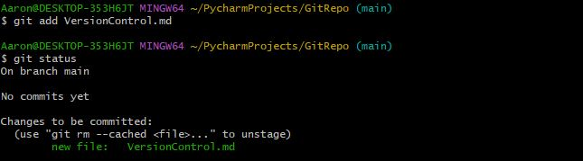
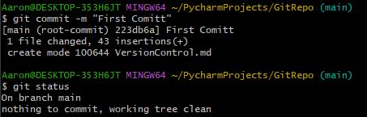

# Version Control, Git, and Github

## What is version Control?

Version control is a system that tracks changes to files over time, so you can review, undo, and  collaborate on work. 

## What is Git? 

Git is a version control system.

## The concept of Staging and Committing 

In Git, staging refers to adding specific file changes to the staging area before committing them. 
<br/> When you commit a file, you are saving a snapshot of the staged changes to the repository's history. 

### Step-by-Step Guide to Staging Changes and committing in Git with Commands :

- If you haven't already installed Git you can click the link and download the latest version for your operating system:
   [Git](https://git-scm.com/downloads)
- Once downloaded you can now open the command line interface, **Git Bash**. 
- Assuming you are in the right directory we can create our Git repository :

```commandline
git init
```
- In this example I have already prepared a file, **VersionControl.md**. I can then check the status.
<br/> Regularly checking the status keeps your workflow organised and helps avoid errors before committing changes.
```commandline
git status
```
  
- we can now send our file to the staging area. Check the status again, did you notice the change? 
```commandline
git add VersionControl.md
```
 

- We are now at the final step, ready to fully commit our file. A commit message serves as documentation for the changes you've made. 
```commandline
git commit -m "First Comitt" 
```


We have now officially committed our first file. 